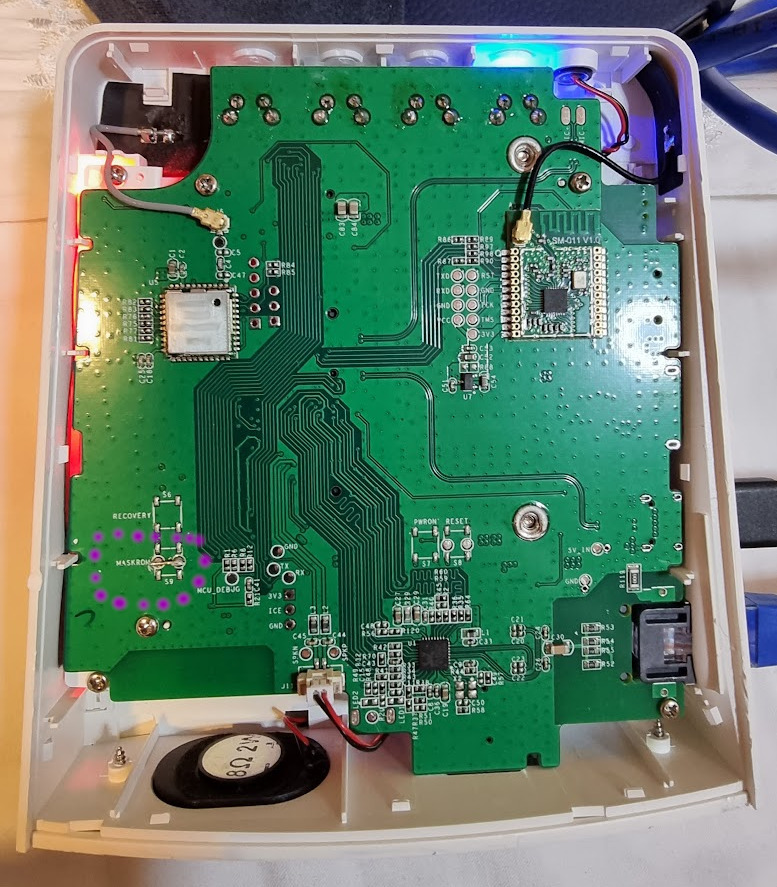
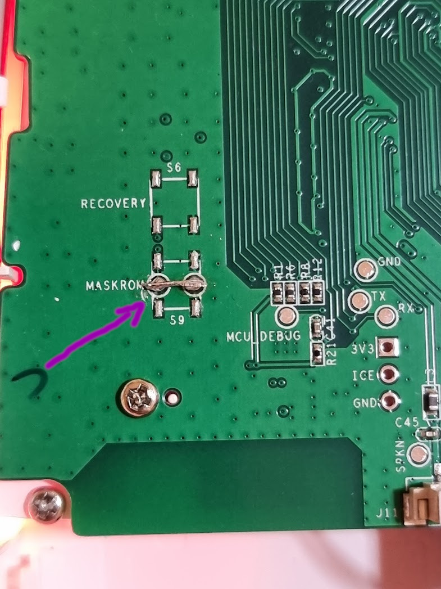

**This is an unofficial port of Home Assistant Operating System (HAOS) to run on Sonoff iHost**

### Files you will use are:

* `boot.img.xz` - Installer image that will flash HAOS to eMMC flash. Indicator will turn blue when flash finished (approx 3-5mins)
* `haos_ihost-11.1.img.xz` - Full system image you can run from SD Card (No indicator yet)

Flash images to SD Card using Balena Etcher or Rufus (Windows)

## maskROM
To be able to use HAOS on the iHost, you will need to do a MaskROM (use a non standar ROM on the device).
There are two ways:
1. Overwrite the existing eMMC flash memory with a custom ROM;
2. Setting the device to booting directly from the SD card. 

Today, we recommend choice number 2. Using this way, you will be able to keep original ROM. To do this, you will need to open the right panel of the device, and permanently short the two round contacts on the plate named MaskROM:

Permanently short contacts on internal the two round contacts on the internal plate named  MaskROM:

Then, boot the device with the SD card with the `haos_ihost-11.1.img.xz` image from [latest release](/darkxst/ha-operating-system/releases/latest).

To use option number 1, you can only short it at the startup for a few seconds to flash the image from the SD card to the internal memory permanently. (files `boot.img.xz`)

## Debug Console
You can use the debug console after the HAOS is running.
Power your ihost from a USB port on your PC and you get a debug console on iHost host.
`/dev/ttyACM0` on Linux, `COMx` on Windows. The default user is `root` and there is _no password_

More info related to this can be found here (_Home Assistant Yellow tutorial_):
* [Windows](https://yellow.home-assistant.io/guides/use-serial-console-windows/)
* [Linux and MacOS](https://yellow.home-assistant.io/guides/use-serial-console-linux-macos/)

## USB Updates

Copy the `haos*.raucb` file to USB thumbdrive, name the drive `CONFIG`
From debug console or ssh host shell, run:
`systemctl start hassos-config`
System will reboot and upgrade.

## Datadisk

iHost only has 8GB internal eMMC flash, after initial install you will want to use `Move data disk` feature, to move data to SD card or USB drive under:
`Settings -> System -> Storage`

## Zigbee

On-board EFR32MG21 EZSP Zigbee radio
Port: /dev/ttyS4
Baud: 115200
Flow Control: software

ZHA may require updating firmware first. Use Silabs Flasher addon with custom url. Disable ZHA while flashing.

[EZSP firmware 6.10.7](https://github.com/xsp1989/zigbeeFirmware/raw/master/firmware/Zigbee3.0_Dongle-NoSigned/EZSP/ncp-uart-sw_6.10.7.0_115200.gbl)

[EZSP firmware 7.3.2](https://github.com/darkxst/silabs-firmware-builder/raw/main/firmware_builds/zbdonglee/ncp-uart-hw-v7.3.2.0-zbdonglee-115200.gbl)
