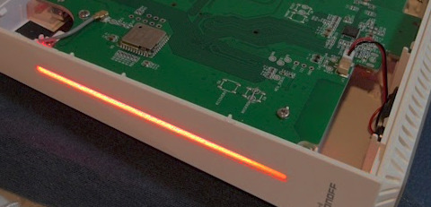

This is a temporary fix to the red flashing light after a reboot of the iHost:

1. Install the AppDaemon from Settings --> Add-On --> Add-on Store
2. Configure it:
* Paste `yc1175-indicator` in the Python packages
* Paste `indicator-cli 4 --effect 0 ` to turn off the light or `indicator-cli 4 --effect 1 --rgb 0 0 255` for constant blue LED
3. Press `SAVE`

4. On the Info page, make sure the Star on boot is ON!

